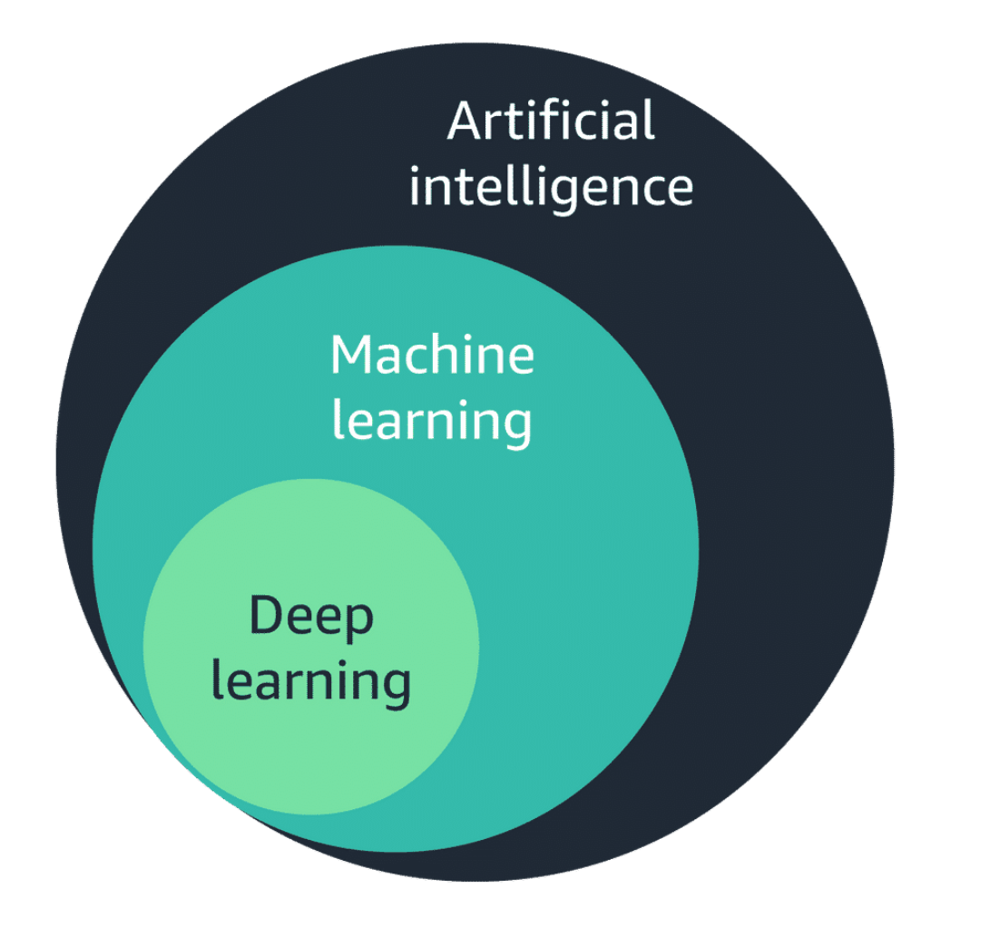
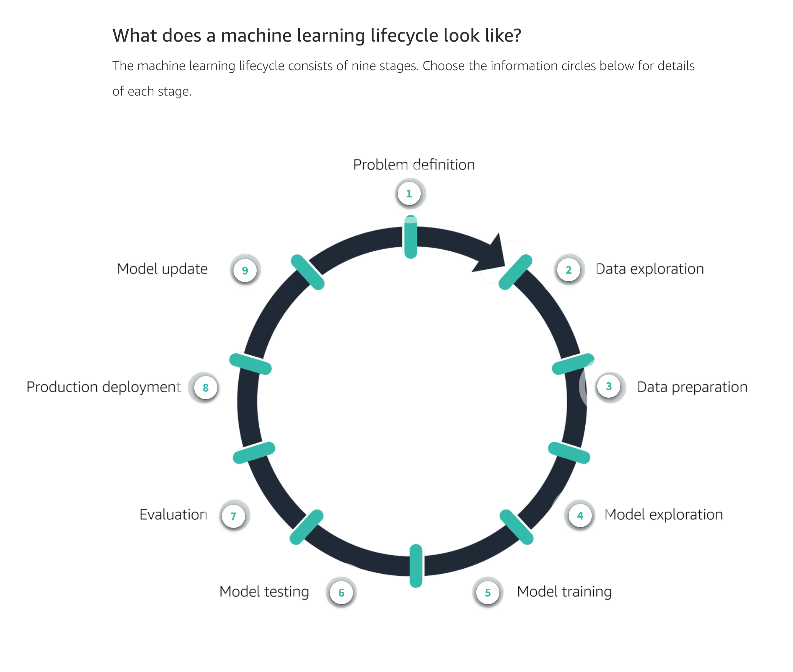
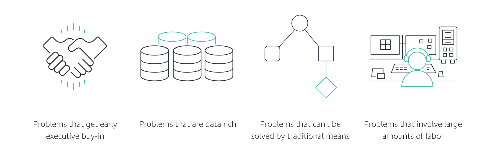

# AWS Machine Learning Specialty
AWS Machine Learning Specialty

## AWS SaaS
Check out this list before spending precious company resources training your own model. Trust me, they are far superiour.

- Amazon Forecast - resouce forecasting from various datasources
- Amazon Lookout for Metrics - anomaly detection for cloudwatch metrics
- Amazon Fraud Detector
- Amazon Personalize - personal recommendation engine
- Amazon Polly - text to speech (with human-like qualities)
- Amazon Transcribe - speech to text
- Amazon Kendra - AI-powered search
- Amazon Comprehend - natural language processing (keyphrase extraction, sentiment analysis, entity recognition)
- Amazon Rekognition - image entity detection
- Amazon Textract - OCR, form and table data extraction

## Development Platform
So, what you are trying to build is a novel idea... i guess we have no choice but to train your own model. At this point, please let AWS help you not to worry about the end-to-end process of testing and deployment.
- Amazon SageMaker

## Hardware 
- AWS DeepLens

## ML Lifecylce

## Targetting the first ML Project in your Organization

