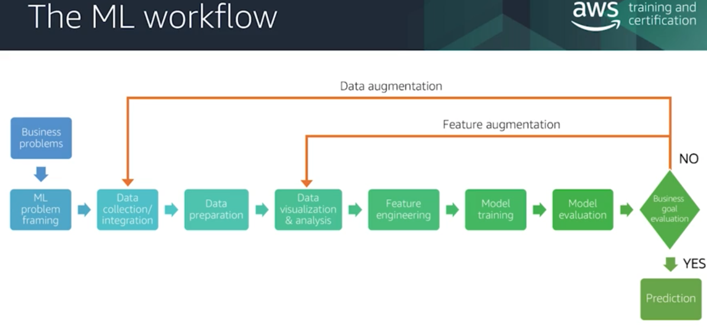

# AWS Machine Learning Specialty
AWS Machine Learning Specialty

## AWS SaaS
Check out this list before spending precious company resources training your own model. Trust me, they are far superiour.

- Amazon Forecast - resouce forecasting from various datasources
- Amazon Lookout for Metrics - anomaly detection for cloudwatch metrics
- Amazon Fraud Detector
- Amazon Personalize - personal recommendation engine
- Amazon Polly - text to speech (with human-like qualities)
- Amazon Transcribe - speech to text
- Amazon Translate - language translation
- Amazon Kendra - AI-powered search
- Amazon Comprehend - natural language processing (keyphrase extraction, sentiment analysis, entity recognition)
- Amazon Rekognition - image entity detection
- Amazon Textract - OCR, form and table data extraction
- Amazon Lex - chatbot

## Development Platform
So, what you are trying to build is a novel idea... i guess we have no choice but to train your own model. At this point, please let AWS help you not to worry about the end-to-end process of testing and deployment.
- Amazon SageMaker

## Hardware 
- AWS DeepLens (AI-Powered Camera)
- Amazon Elastic Inference - on-demand GPU power

## Targetting the first ML Project in your Organization

## ML Lifecylce

- Addressing Overfitting(high variance) /Underfitting (high bias)
  - Regularization - minimize overfitting, add cost to to the parameter L1 (absolute value of the sum), L2 (square value of the parameters) 
  - Feature extraction - create new features from existing features
- Tuning
  - Hyperparameter Tuning - depends on model architecture, set by the engineer, not part of the estimation
- Model Evaluation Metrics
  - Accuracy
  - Precision
  - Recall
  - F1

